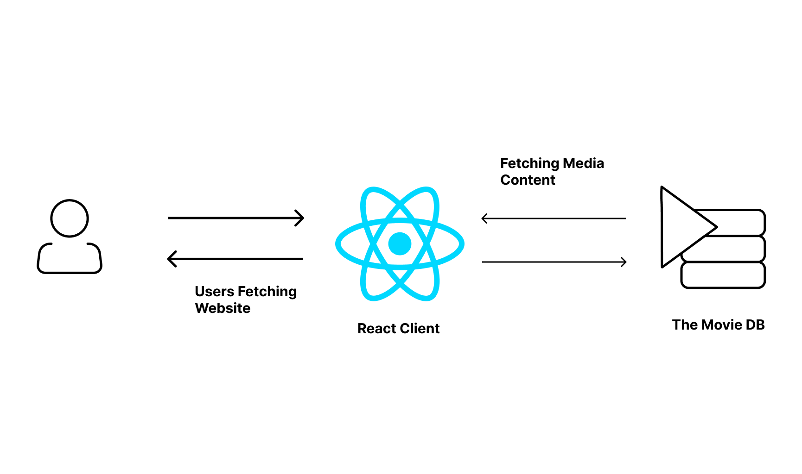

# NOT NETFLIX

# Explore your favourite movies

## Installation

```
git clone https://github.com/ak14aman/NOT-NETFLIX.git
cd not-netflix
npm install
npm start
```

</br>

## Architecture

</br>



## Libraries used

### Frontend

<ul>
<li>React - Frontend Library used to make the frontend</li>
<li>moviedb-promise - Used to get Movie Details</li>
<li>Material UI - Used to create clean and elegant looking components</li>
<li>Redux - Used to store the state of the app</li>
</ul>

### Backend

<ul>
<li>Firebase - Used for User Authentication</li>
</ul>

## Thought process

React Client fetches the movie data from the MovieDB API and renders the data in the form of Material Components.

## Design Choices

Material UI is used here because the components are quite clean and easy to use. A Grid View is used to display movie cards in the App.
